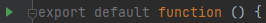
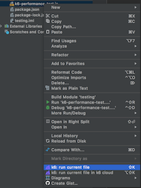
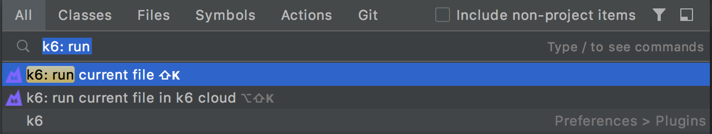
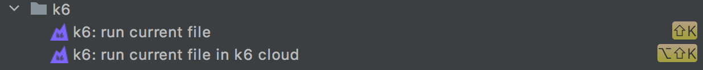
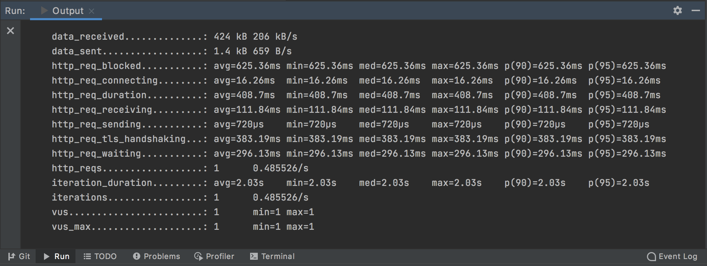
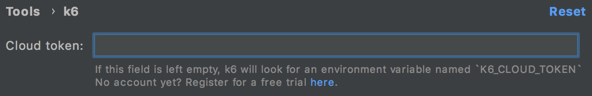
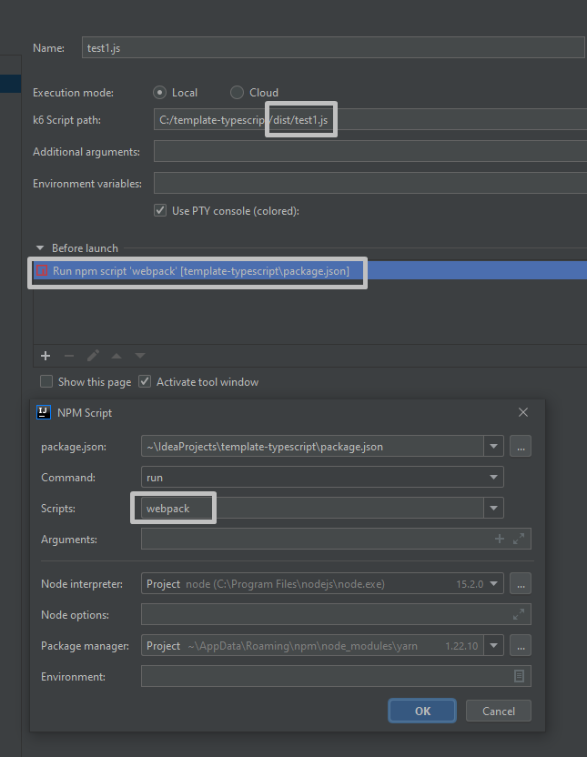
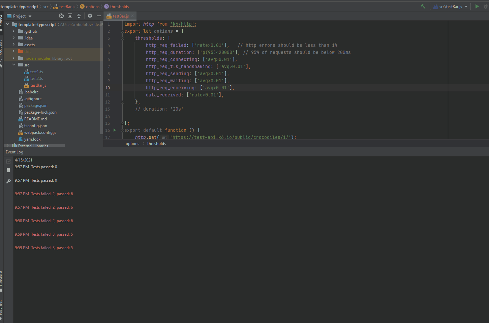
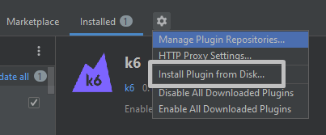

<!-- Plugin description -->

IntelliJ-based Plugin to run [k6 tests](https://k6.io/) locally or in the [k6 Cloud](https://k6.io/cloud) from your IntelliJ IDE. 

- Run a k6 test as a Run configuration (a common way to run something withing IntelliJ platform)
- Run a k6 test using keyboard shortcuts.
- Run a k6 test from the search Menu.
- Run a k6 test from the popup file menu.
- Visualize the k6 results in the Run tool window.

<!-- Plugin description end -->


## How it works

This plugin allows running a k6 test in the 4 different ways:

### Run the test as a Run configuration.

A k6 run configuration can be created in several ways:
* By clicking on a green run gutter near the `default function` in the editor: 
* Via the context menu of a k6 test file
* Using the `Run/Debug Configurations` dialog window

Once a run configuration is created, it can be used multiple times to execute the test.

Beside the test path itself, a run configuration can define some other properties to be used to execute the test:
* `Local`/`Cloud` run type selection
* Additional CLI parameters, like `--vus 10`
* Additional environmental variables
* Define whether to show each threshold as a separate test in the test console by selecting the `Show thresholds as tests` checkbox 

Default values for each of the properties can be defined via a `Run configuration template`.

### Run the test from the popup file menu. 

Select the test file, open the file options and click on `k6: run current file` or `k6: run current file in k6 cloud`.



### Run the test from the Search Menu. 

From the main menu, select Navigate | Search Everywhere or press `Shift` twice to open the search window. Search for `k6` and trigger `k6: run current file` or `k6: run current file in k6 cloud`.



### Run the test using keyboard shortcuts. 

By default, `Alt+K` for running local tests, and `Alt+Shift+K` for cloud tests.




When IntelliJ IDEA runs a k6 test, the [Run tool window](https://www.jetbrains.com/help/idea/run-tool-window.html) will display the test results generated by k6.



For running cloud tests, set your [k6 Cloud Token](https://app.k6.io/account/token) in `Settings/Preferences/Tools/k6`. 


                                                

## Run a test written in TypeScript 

k6 does not support running a typescript test directly. To execute both build task and run test actions **in one click** you can define a `Run configuration` 
to run your *compiled js test* and to execute a npm build script before launch:



## Show thresholds as tests
When `Show thresholds as tests` checkbox is selected in a run configuration, the plugin will display each configured threshold as a passed or failed test inside the test console tree view:


Each of the threshold entry is clickable and navigates to the threshold source element by double click (or key shortcut).
Under the hood, the plugin utilises `handleSummary` callback to collect the test execution results, so it has to wrap original script and proxy the calls.  

## Installation 

- In the Settings/Preferences dialog, select Plugins. 
- Use the Marketplace tab to find the k6 plugin. 
- Click install.
- Enjoy!

### Build plugin from the sources

```bash
./gradlew buildPlugin
````
Install plugin from local file system via the following menu item: 


### Start IDE bundled with plugin via gradle:

```bash
./gradlew runIde
```                                            

